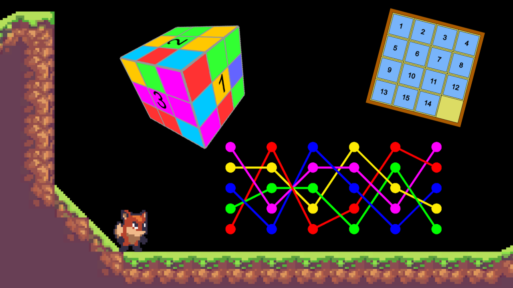

# The Permutation Game

This is one of the games I am creating in my journey to learn game developement, and of course mix it with mathematics.

The main theme of this game is going to be about permutations. For examples, how to combine them together create new permutation, what happens when you apply the same permutation again and again and again (namely, their orbits), and maybe all sorts of interesting invariants hiding there (e.g. parity of permutations).

Right now I started with a sort of puzzle game inside a 2d platformer, though this was just an easy place to start, so I might change it later on.

In any case, this is a good source for explaining interesting ideas in mathematics, and I made several videos about them:

1. **Playing with permutations**: about cycle decomposition and order of permutation.
	1. [English version](https://youtu.be/Cf0Idockbm0)
	2. [Hebrew version](https://youtu.be/0sikpx1iatc)
2. **Parity, and how to find cheaters**: Naturally discovering the cross number and parity of a permutation, and how it relates to unsolvable games.
	1. English version: Hopefully soon ...
	2. [Hebrew version](https://youtu.be/q3GBajdUkYo)

In general, you can find more videos about other mathematical games I am develpoing in these youtube accounts.

The extra assets and pluging are not in this repository. You can find their names in the "Assets/extra assets.txt" file. I only used free assets so far.

---

**My homepage**: [https://prove-me-wrong.com/](https://prove-me-wrong.com/)

**Contact**:	 [totallyRealField@gmail.com](mailto:totallyRealField@gmail.com)

**Ofir David**